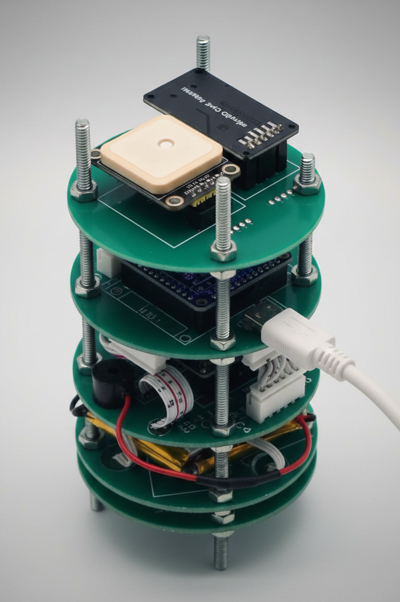
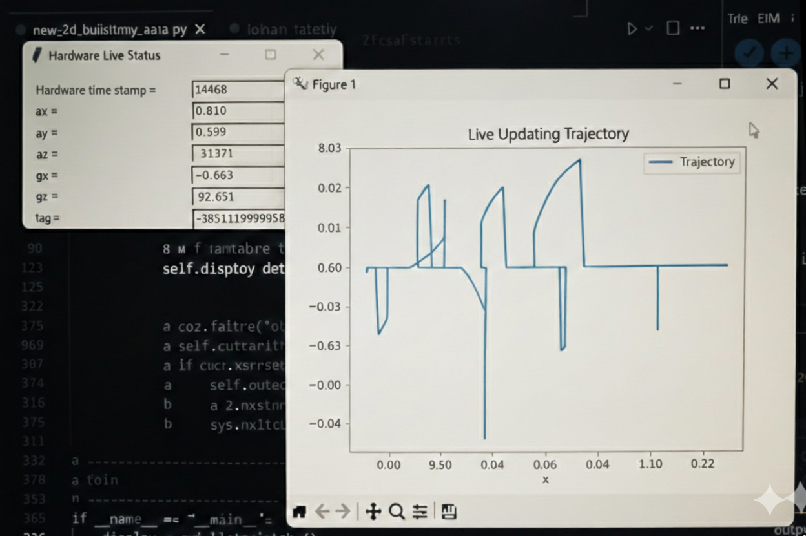

# 🛰️ CanSat 2D Trajectory Tracker

Real-time trajectory estimation system for CanSat using IMU sensor fusion and advanced filtering techniques.

[](https://www.python.org/)
[](LICENSE)

## 📋 Overview

This system processes real-time sensor data from a CanSat's IMU to estimate and visualize its 2D trajectory. It combines multiple filtering techniques including Kalman filtering, complementary filtering, and signal processing methods to achieve accurate position tracking from raw accelerometer and gyroscope data.

**Key Features:**
- Real-time serial data acquisition from CanSat hardware
- Automatic sensor calibration on startup
- Dual orientation estimation (Kalman + Complementary filters)
- Advanced gravity compensation and noise filtering
- Live trajectory visualization with matplotlib
- Hardware timestamp synchronization and lag monitoring
- Modular architecture for easy experimentation


---

### 🛰️ CanSat Hardware

*My CanSat setup built for the competition.*

## 🚀 Quick Start

### Prerequisites

```bash
pip install numpy opencv-python matplotlib pyserial
```

### Basic Usage

1. **Connect your CanSat** to the computer via serial port
2. **Run the main script:**

```bash
python new_2d_trajactory_class.py
```

3. **Select COM port** from the GUI dialog
4. **Wait for calibration** (collects 300 packets, ~3 seconds)
5. **View live trajectory** in the matplotlib window

## 🏗️ System Architecture

```
┌─────────────────┐
│   CanSat IMU    │
│  (Accelerometer │
│   + Gyroscope)  │
└────────┬────────┘
         │ Serial (115200 baud)
         ▼
┌─────────────────┐
│ Serial Reader   │ ← Packet parsing & threading
└────────┬────────┘
         ▼
┌─────────────────┐
│  Calibration    │ ← Bias estimation (300 samples)
└────────┬────────┘
         ▼
┌─────────────────────────────────────────┐
│     TrajectoryProcessor Pipeline        │
├─────────────────────────────────────────┤
│ 1. Bias Correction                      │
│ 2. Orientation Estimation (Kalman)      │
│ 3. Gravity Component Removal            │
│ 4. Low-pass Gravity Estimation          │
│ 5. High-pass Noise Filtering            │
│ 6. Moving Average Smoothing             │
│ 7. World Frame Rotation                 │
│ 8. Real-time Gyro Calibration           │
│ 9. Position Integration                 │
└────────┬────────────────────────────────┘
         ▼
┌─────────────────┐
│ Visualization   │ ← Live plot + Debug GUI
└─────────────────┘
```

## 📁 Project Structure

```
├── new_2d_trajactory_class.py    # Main trajectory processor
├── serial_reader.py               # Serial communication handler
├── kalman_filter.py               # Kalman filter implementation
├── fusion_filter.py               # Complementary filter
├── callibrate_gyro_real_time.py  # Dynamic gyro calibration
├── live_matlib_plot.py            # Live matplotlib plotting
├── gui.py                         # Tkinter debug GUI
├── serial_port_button.py          # COM port selector
├── data_logger.py                 # CSV data logging utility
├── cv_plot.py                     # OpenCV visualization (legacy)
└── python_timeStamp.py            # Timestamp processing
```

## 🔧 Core Modules

### TrajectoryProcessor

The main processing pipeline that handles:
- **Calibration**: Automatic bias estimation from initial stationary period
- **Filtering**: Multi-stage noise reduction and signal conditioning
- **Integration**: Double integration of acceleration to position
- **Visualization**: Real-time plotting and debugging

### SerialReader

Threaded serial communication with:
- Custom packet protocol (`0xAA 0xBB 0xCC 0xDD` header)
- Binary data unpacking (18 float values + timestamp)
- Callback-based data delivery
- Buffer management and packet alignment

### KalmanFilter

1D Kalman filter for roll/pitch estimation:
- Fuses gyroscope and accelerometer data
- Provides optimal angle estimates
- Handles sensor noise and bias drift
- Configurable process and measurement noise

### ComplementaryFilter

Lightweight sensor fusion alternative:
- High-pass filtered gyroscope (short-term accuracy)
- Low-pass filtered accelerometer (long-term stability)
- Adjustable alpha parameter (default: 0.98)

## 📊 Data Flow

### Packet Structure
The CanSat transmits 72-byte packets at 100 Hz:

| Field | Type | Description |
|-------|------|-------------|
| Temperature | float | Ambient temperature (°C) |
| Altitude | float | Barometric altitude (m) |
| Pressure | float | Atmospheric pressure (Pa) |
| Heading | float | Magnetic heading (°) |
| ax, ay, az | float | Acceleration (m/s²) |
| gx, gy, gz | float | Angular velocity (°/s) |
| mx, my, mz | float | Magnetic field (µT) |
| sat, lat, lon, gpsAlt | float | GPS data |
| HardwareTimestamp | uint32 | MCU timestamp (ms) |

### Processing Pipeline Details

1. **Calibration Phase** (0-3s)
   - Collect 300 packets while stationary
   - Compute mean bias for all 6 DOF
   - Gravity-compensate Z-axis

2. **Real-time Processing**
   - Apply bias correction
   - Estimate orientation (Kalman filter)
   - Remove gravity component using trigonometric projection
   - Apply low-pass filter to estimate gravity vector
   - High-pass filter to remove DC drift
   - Moving average smoothing (5-sample window)
   - Rotate to world frame
   - Dynamic gyro recalibration (during stationary periods)
   - Integrate acceleration → velocity → position

## 🎛️ Configuration

### Filter Parameters

```python
# Kalman Filter
Q_angle = 0.01   # Process noise - angle
Q_bias = 0.01    # Process noise - gyro bias
R_measure = 0.1  # Measurement noise - accelerometer

# Complementary Filter
alpha = 0.98     # Gyro trust factor (0.9-0.99)

# High-pass Filter
hp_alpha = 0.9   # High-pass coefficient
threshold = 0.03 # Noise threshold (m/s²)

# Smoothing
BUFFER_SIZE = 5  # Moving average window
```

### Scaling & Calibration

```python
# Acceleration scaling (if needed)
ax_scale = 1.0
ay_scale = 1.0
az_scale = 1.0

# Local gravity constant
g = 9.87  # m/s² (adjust for location)
```

## 📈 Visualization

The system provides two visualization modes:

### Live Matplotlib Plot
- Real-time XY trajectory
- Auto-scaling axes
- Interactive zoom/pan

### Debug GUI (Tkinter)
- Hardware/software timestamp comparison
- Lag monitoring
- Raw sensor values
- Filtered outputs
- Current position estimates

### 💻 GUI Screenshot

*Live trajectory tracking and sensor debug GUI.*

## 🛠️ Advanced Usage

### Data Logging

Enable CSV logging for analysis:

```python
self.Logger = Logger('trajectory_data.csv')
# In update loop:
self.Logger.write(f"{timestamp},{x_pos},{y_pos},{ax},{ay}")
```

### Custom Visualization

Switch to OpenCV-based video output:

```python
# Uncomment in new_2d_trajactory_class.py:
# cv2.imshow('Plot', img)
# self.out.write(img)
```

### Adjust Integration Thresholds

Fine-tune position update sensitivity:

```python
# In integrate_position()
if abs(self.x_current) > 0.001:  # Adjust threshold
    self.x_new = self.x_pos[-1] + self.x_current
```

## 🐛 Troubleshooting

| Issue | Solution |
|-------|----------|
| No COM ports detected | Check USB connection, install CH340/FTDI drivers |
| Drift in trajectory | Increase calibration samples, check sensor mounting |
| Lag warnings | Reduce baud rate or processing load |
| NaN/Inf errors | Verify sensor data ranges, check division by zero guards |
| Plot not updating | Ensure `plt.ion()` is called, check matplotlib backend |

## 📝 Example Output

```
Calibration Complete
Hardware_timeStamp = 1523, python_timeStamp = 1525.34, lag = 2.34,
ax = 0.023, ay = -0.041, az = 0.002, pitch = 1.2, roll = -0.8,
gx = 0.001, gy = 0.002, gz = -0.001, x_pos = 0.145, y_pos = -0.089
```

## 🔬 Algorithm Details

### Gravity Removal Strategy
Uses both analytical and empirical methods:
1. **Trigonometric projection**: Removes gravity components using roll/pitch angles
2. **Low-pass estimation**: Tracks slow-varying gravity vector
3. **Subtraction**: Removes estimated gravity from raw acceleration

### Real-time Gyro Calibration
Dynamically updates gyro bias during flight:
- Detects stationary periods (low acceleration + low angular velocity)
- Updates bias with exponential moving average
- Prevents drift accumulation

## 🤝 Contributing

Contributions welcome! Areas for improvement:
- GPS-aided position fusion
- Adaptive filter tuning
- Machine learning drift correction
- Extended Kalman Filter (EKF) implementation
- Altitude integration from barometer

## 📄 License

MIT License - feel free to use in your projects

## 🙏 Acknowledgments

Built for CanSat competitions and educational rocketry projects. Inspired by real satellites, quadcopter flight controllers, and academic sensor fusion research. Developed as part of the CanSat competition organized by SUPARCO Pakistan at RESOLVE, UET Lahore.

---

**Happy Flying! 🚀**

For questions or feedback, feel free to open a GitHub issue or reach out to me directly.
